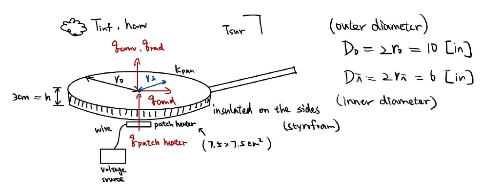
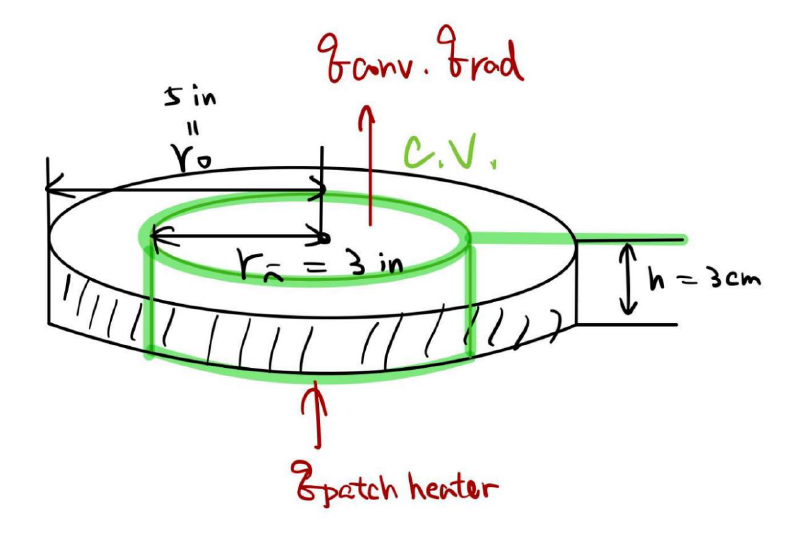
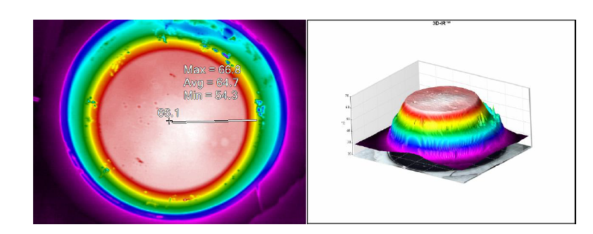
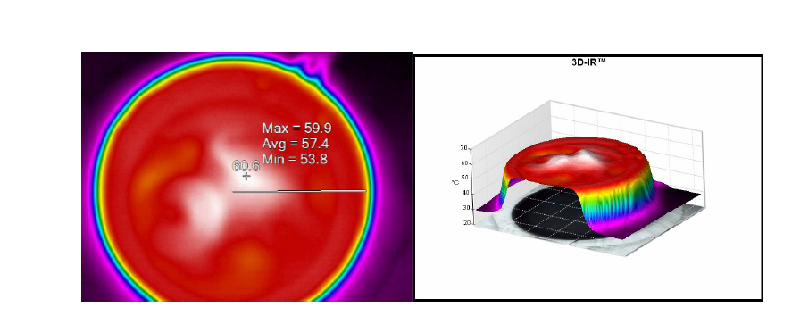
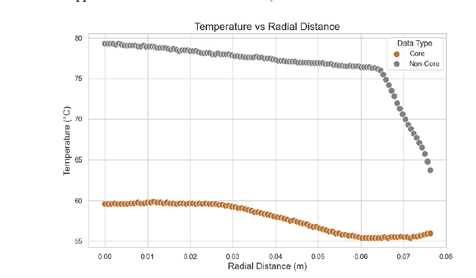
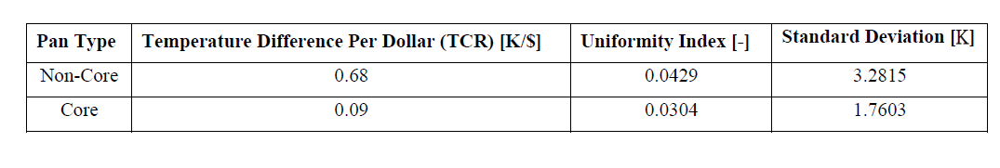
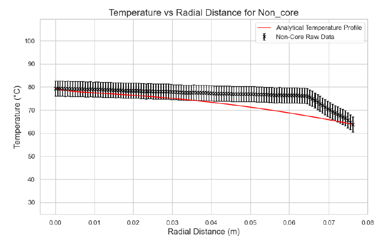
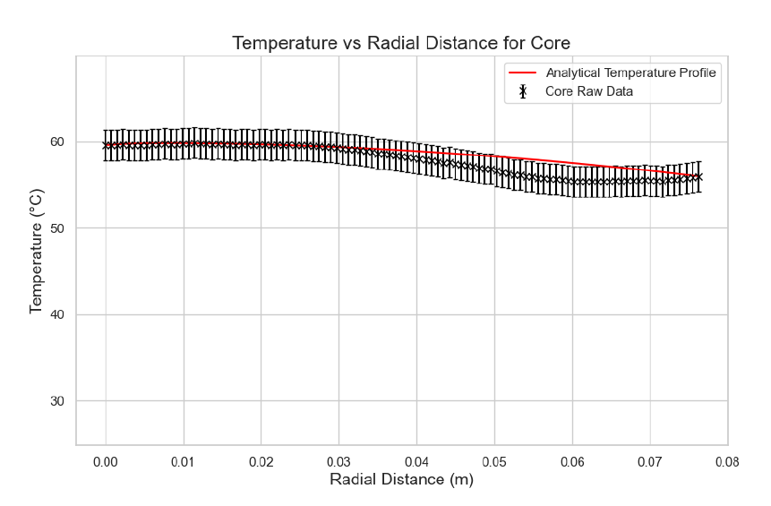

# Pan Heat Distribution Project
This project's goal is to determine whether the inclusions of a copper core in stainless steel pans better provides even distribution about its surface.  

## Experimental Method and Modelling
This research investigated the thermal performance characteristics of stainless-steel cookware, focusing on comparing pans with and without a copper core. The primary objective was to comprehensively assess heat distribution uniformity, cost-efficiency, and thermal transfer mechanisms across different pan configurations. The study employed a centrally mounted patch heater, high-resolution infrared thermal imaging, and advanced analytical modeling to systematically evaluate the thermal behavior of two 10-inch stainless steel pans. The following images showcase how we setup and modeled the heat transfer problem

## Infrared Camera Captures for Core and Non-Core Pan

## Analytical Results and Conclusion
The copper core pan showcased 29% enhancement in heat distribution uniformity, with the standard deviation reduced from 3.2815 to 1.7603. Furthermore, it demonstrated an 86.8% reduction in temperature variability per dollar, with Temperature Cost Ratio (TCR) of 0.09 K/$ in comparison to the 0.68 K/$. 

These results indicated significantly more consistent and predictable heating characteristics, with analytical modeling showing substantially lower percentage errors compared to the non-core pan. 

Check these links out for more details:

[Project Report](documentation/ME_315_Final_Report_Team_50-5.pdf)
[Data Collection](data_analysis/data)
[Data Analysis](data_analysis/dataAnalysis.ipynb)
